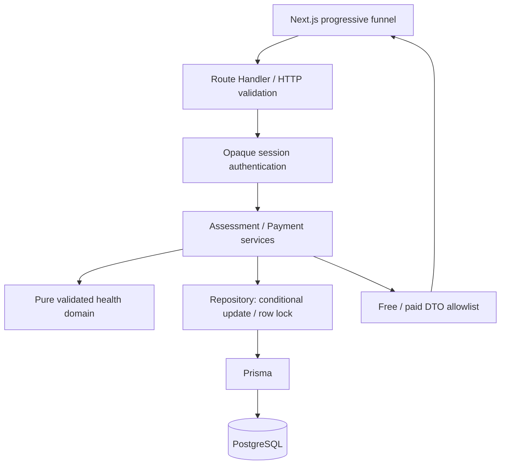
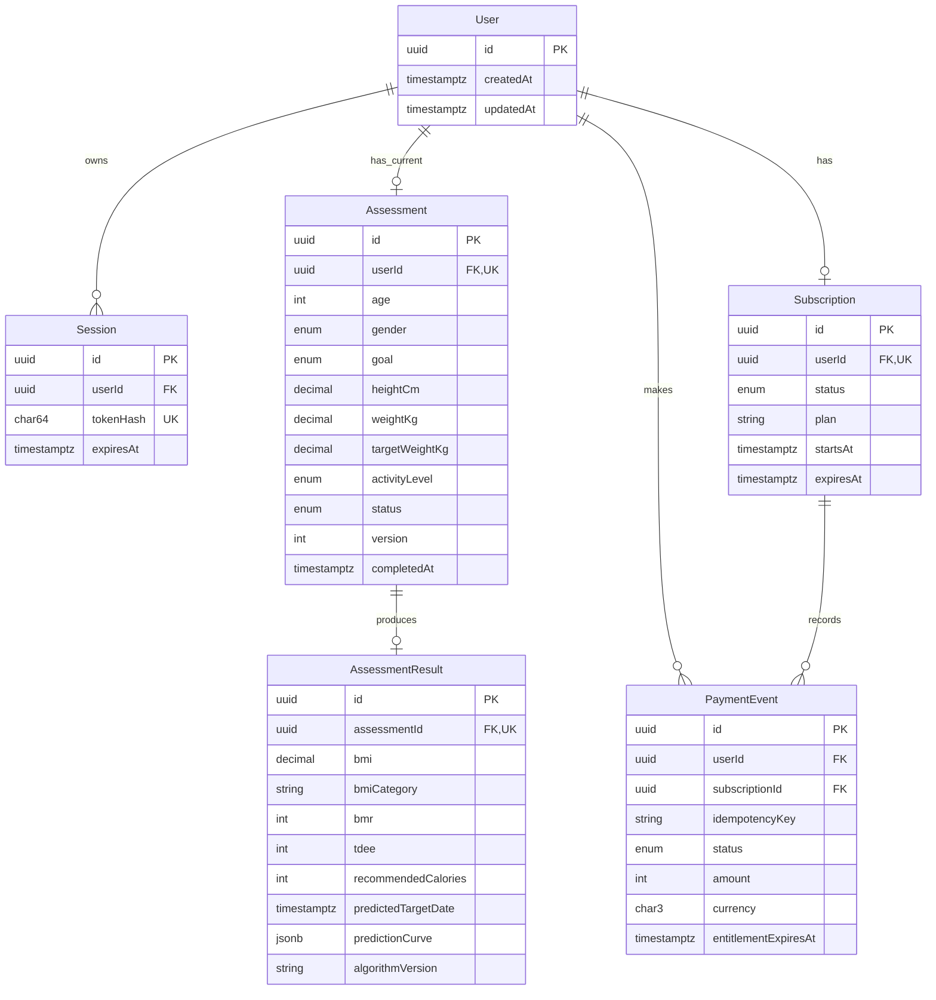

# 轻衡 · Health Assessment

一个可以中断恢复、由服务端计算结果、并在模拟订阅后解锁完整结果的健康测评。重点是明确的数据边界、真实 PostgreSQL 上的并发与事务验证，以及可以重放的演示闭环。

**This assessment is for demonstration purposes only and is not medical advice.**

这是匿名、成人、虚构支付的技术演示。不会收取费用，不提供医疗诊断。公网部署及 CI 的实际状态以 [交付记录](docs/delivery.md) 为准。

## 本地启动

要求 Node.js 22、npm、PostgreSQL 17。锁文件固定依赖；Next.js 16.3.5 App Router、React 19、TypeScript strict、Prisma 6.19、Zod、Vitest、Playwright。Prisma 固定在已验证的 6.19，以减少此交付引入主版本迁移风险。

```bash
npm ci
cp .env.example .env
docker compose up -d
docker compose exec db createdb -U health health_test
npm run db:migrate
npm run db:seed
npm run dev
```

Windows PowerShell 使用 `Copy-Item .env.example .env`。访问 [本地演示](http://localhost:3000)。`createdb` 只在首次创建测试库时执行。

没有可运行的 Docker 时，可在单独终端运行 `npm run db:local`；它启动真实 PostgreSQL 并创建两个开发数据库，数据留在被 Git 忽略的 `.local-postgres`。Windows 使用临时盘符处理中文路径，正常 Ctrl+C 后释放盘符。此辅助入口使用第三方打包的 PostgreSQL；CI 使用官方 PostgreSQL 容器。

```bash
npm run lint
npm run typecheck
npm test
npm run test:coverage
npx playwright install chromium
npm run test:e2e
npm run build
npm start
```

`npm test` 一键执行单元与真实数据库 HTTP 集成测试；浏览器 E2E 单独运行，CI 会运行两者。测试不依赖正在运行的开发服务器，E2E 自动启动独立的 3100 端口服务。

## 配置

| 变量 | 用途 |
| --- | --- |
| `DATABASE_URL` | 应用 Prisma PostgreSQL 连接。线上必须使用私有环境变量。 |
| `TEST_DATABASE_URL` | 独立测试库，数据库名必须以 `_test` 结尾。 |
| `APP_ORIGIN` | 浏览器写请求允许的完整 origin，含协议与端口；线上设为实际域名。缺省时使用请求 URL origin。 |
| `DEMO_MODE` | 只有字符串 `true` 开启模拟支付与 demo seed。部署本挑战必须开启。 |

不需要 `SESSION_SECRET`：身份是高熵随机 token，数据库只存 SHA-256 摘要，并非可伪造的客户端签名内容。开发密码仅用于本地回环地址/CI。真实 `.env`、demo cookie、`.vercel` 均不提交。

## 架构与模型



Route handlers 只适配 Web Request/Response；HTTP 层处理协议、身份、错误；service 管理业务事务；repository 集中 CAS 和锁；纯函数计算无需数据库。集成测试在 Node HTTP 适配器上调用同一个生产 `handleApi`，不是 mock；Playwright 进一步覆盖实际 Next.js 路由和浏览器。



核心答案为 typed columns，只有预测曲线使用 JSONB。测量值 `Decimal(5,2)`，接口和 domain 均拒绝超过两位的小数，避免数据库静默舍入。年龄/版本为整数，类别使用数据库枚举，时间使用带时区时间戳。SQL CHECK 补充数值、目标方向、完成状态、订阅日期、模拟金额约束。

当前范围每个用户一份测评、一个订阅；User→Session 是一对多。结果必须唯一关联测评；`(userId,idempotencyKey)` 唯一。Session 失效清理可走过期索引。外键级联适合删除完整匿名聚合；真实支付系统应另行设计不可删除的财务账本。扩展多次测评时移除 Assessment.userId 唯一键，并在 User 上显式选择当前测评。

`currentStep` 与 `completedSteps` 由持久化字段推导，避免多个“进度真相”相互冲突。完成前允许回退修改；改变目标会清空旧身体数据及活动答案，要求重新确认。完成后答案冻结。

## API

所有成功响应为 `{ "data": ... }`，失败为 `{ "error": { "code", "message", "details"? } }`。写请求必须 `Content-Type: application/json`，最大 16 KiB，拒绝未知字段及字符串转数字。返回 `Cache-Control: no-store, private`，免费权限不是前端隐藏。

身份凭据为 `health_session` cookie：32 随机字节、HttpOnly、SameSite=Lax、30 天、production Secure。`sessionId`/`userId` 只用于标识，不能拿来冒充 token。每次请求查 session 是否存在、是否过期，并始终以其 userId 查询。浏览器写入检查 Origin 和 Sec-Fetch-Site，curl 可不发送 Origin。

| 方法与路径 | 请求 | 成功 data / 关键异常 |
| --- | --- | --- |
| `POST /api/v1/session` | `{}` | 201 新建或 200 恢复；`sessionId,userId,expiresAt`；Set-Cookie 仅新建时设置。无效/过期旧 cookie 建立新匿名身份。 |
| `GET /api/v1/assessment/current` | 无 | `id,currentStep,completedSteps,progress,data,version,status`；无身份 401。 |
| `PATCH /api/v1/assessment/current/steps/age` | `{version,age}` | 返回更新后的完整进度；年龄 18–100 整数。 |
| `PATCH .../steps/gender` | `{version,gender}` | `MALE / FEMALE`；公式所需参数，不代表完整性别认同模型。 |
| `PATCH .../steps/goal` | `{version,goal}` | `LOSE_WEIGHT / MAINTAIN_WEIGHT / GAIN_WEIGHT`。 |
| `PATCH .../steps/body` | `{version,heightCm,weightKg,targetWeightKg}` | 身高 120–230 cm，体重及目标 35–300 kg，最多 2 位小数，目标方向与 BMI 校验。 |
| `PATCH .../steps/activity` | `{version,activityLevel}` | `SEDENTARY / LIGHT / MODERATE / ACTIVE / VERY_ACTIVE`。 |
| `POST /api/v1/assessment/current/complete` | `{version}` | 原子保存结果并冻结答案，返回当前授权结果；缺数据/版本过期 409。已完成的重放安全，不新增结果。 |
| `GET /api/v1/result` | 无 | 免费或完整结果；未完成 404，缺失/过期身份 401。 |
| `POST /api/v1/pay`、`POST /pay` | `{plan:"premium"}` + `Idempotency-Key` | `paymentId,status,plan,amount:0,currency:"USD",expiresAt,simulated:true`。 |

步骤正常顺序 `age → gender → goal → body → activity → complete`。未来步骤 409，未知步骤 404，非法参数 422，非法 JSON 400，不支持内容类型 415，跨站写入 403，请求过大 413。完成后写入 409。版本冲突错误码 `VERSION_CONFLICT`；应重新 GET 显示服务器最新答案，不可悄悄覆盖。数据库暂时争用返回 503 + Retry-After，可保留原版本或支付 key 重试。内部错误不返回堆栈。

免费结果示例（保护字段完全不存在）：

```json
{"data":{"bmi":26.2,"bmiCategory":"OVERWEIGHT","subscriptionRequired":true}}
```

会员增加 `bmr,tdee,recommendedCalories,predictedTargetDate,predictionCurve,algorithmVersion`，`subscriptionRequired:false`。授权要求 ACTIVE、开始时间不晚于现在、过期时间晚于现在；不依赖后台定时任务将状态改为 EXPIRED。订阅过期后下一次读取立即裁剪。完成接口也经过同样 DTO，不能旁路泄漏。

### 完整 cURL 重放

以下为 Bash/curl，Windows 可在 Git Bash 执行（PowerShell 使用 curl.exe 并调整 JSON 引号）。首次用 Cookie jar 存身份，后续请求始终携带。

```bash
BASE=http://localhost:3000 # 线上替换成已部署域名
curl -sS -c cookies.txt -H 'Content-Type: application/json' -d '{}' "$BASE/api/v1/session"
curl -sS -b cookies.txt -H 'Content-Type: application/json' -X PATCH -d '{"version":0,"age":30}' "$BASE/api/v1/assessment/current/steps/age"
curl -sS -b cookies.txt -H 'Content-Type: application/json' -X PATCH -d '{"version":1,"gender":"MALE"}' "$BASE/api/v1/assessment/current/steps/gender"
curl -sS -b cookies.txt -H 'Content-Type: application/json' -X PATCH -d '{"version":2,"goal":"LOSE_WEIGHT"}' "$BASE/api/v1/assessment/current/steps/goal"
curl -sS -b cookies.txt -H 'Content-Type: application/json' -X PATCH -d '{"version":3,"heightCm":180,"weightKg":85,"targetWeightKg":75}' "$BASE/api/v1/assessment/current/steps/body"
curl -sS -b cookies.txt -H 'Content-Type: application/json' -X PATCH -d '{"version":4,"activityLevel":"MODERATE"}' "$BASE/api/v1/assessment/current/steps/activity"
curl -sS -b cookies.txt -H 'Content-Type: application/json' -d '{"version":5}' "$BASE/api/v1/assessment/current/complete"
curl -sS -b cookies.txt "$BASE/api/v1/result"
curl -sS -b cookies.txt -H 'Content-Type: application/json' -H 'Idempotency-Key: reviewer-payment-001' -d '{"plan":"premium"}' "$BASE/pay"
curl -sS -b cookies.txt "$BASE/api/v1/result"
# 重复执行相同 /pay 请求，paymentId 与 expiresAt 不变。
```

模拟支付是已鉴权用户主动触发的演示回调，不是生产支付 webhook，不连接 Stripe。真实回调须验证供应商签名、金额/币种/订单、重放与事件时序；不能直接复用本接口开放真实会员。

### 并发与一致性

- 步骤保存使用单条带 `id + version + IN_PROGRESS` 条件的 UPDATE，并返回被更新记录。零匹配映射为 409。先读后的普通 UPDATE 不足以防丢失更新。
- 完成请求检查客户端版本，以用户行锁序列化重复完成，再在同一事务内 CAS 状态、创建唯一结果。与同时保存竞争时，要么保存先成功并导致完成 409，要么完成先成功使保存 409。
- 支付先锁该 User 行，检查用户内 key，再原子更新 Subscription 和插入 PaymentEvent。并发同 key 只产生一条事件。不同 key 在有效会员期间也不累计延长时长。重放旧 key 返回当时的事件/权益到期快照，不会重新激活已过期权益。
- 交互事务显式设置 10 秒获取等待及 10 秒执行上限。503 不表示调用方可以更换支付 key，必须先用同 key 重试/查询结果。

## 健康算法

输入范围是演示产品边界，不是所有成人的生理范围。未满 18 岁、孕期、疾病、运动员等特殊情况没有建模，不应使用这些估算作临床判断。

BMI = kg / m²。按**未舍入**值分类 `<18.5 / <25 / <30 / ≥30`，显示时保留 1 位。BMR 用 Mifflin–St Jeor：`10×kg + 6.25×cm − 5×age + sexConstant`，男 +5、女 −161；TDEE = BMR × 活动系数 `1.2,1.375,1.55,1.725,1.9`。减重 −500、维持 +0、增重 +300 kcal；演示下限男 1500、女 1200，并不等于针对个人的安全医学处方。

减重目标须低于当前，增重须高于当前，维持须相等。改变体重时目标 BMI 约束为 18.5–30；维持模式不要求目标 BMI 处于该区间。预测采用固定示例速度减重 0.5 kg/周、增重 0.25 kg/周，最后一点到目标，日期按向上取整的天数以 UTC 时间戳计算。**速度不由热量差推导，不承诺结果**，热量下限与个人需求可能有冲突。维持预测日期为 null，曲线只有当前点。记录 `algorithmVersion=1.0.0`，结果不随刷新重新计算。所有时间/小数边界有测试。

## 自动化质量

为何选择这些场景：本项目主要风险是中断丢数据、并发覆盖、付费字段旁路泄漏、重复支付发放，以及数值/日期边界；测试针对这些可造成实际错误的分支，而非凑接口数量。

| 层次 | 验证范围 |
| --- | --- |
| Unit | BMI 阈值及未舍入分类；两种公式常数、活动系数、热量/下限；方向冲突；空值/缺失/字符串/NaN/Infinity/越界；小数精度；UTC/无效时间/溢出；维持和曲线终点。 |
| PostgreSQL HTTP integration | hash-only session、恢复/过期/伪造；分步保存/回退/重复/乱序；同版本竞争只一方成功；旧版本完成拒绝；重复/并发完成；未知字段/注入/JSON/请求大小/Origin；结果授权；支付相同 key 并发、跨用户同 key；过期降权；数据库 CHECK；人为数据库写入故障下完整回滚。 |
| Contention | 测试连接池只允许 2 个连接；持有真实 User 行锁 3 秒再发并发支付，超过 Prisma 默认 2 秒获取等待，验证配置及幂等性。 |
| Browser E2E | 真实 Next.js 和真实 PostgreSQL，逐步填写、中断刷新、免费接口保护字段不存在、模拟支付后完整字段、手机宽度布局。 |

每次 `npm test` 创建随机 schema，迁移后执行，最后只 DROP 自己生成的 schema；不执行整库 reset。测试库名称保护 `_test` 防误用，仍应使用独立测试库凭据。各用例创建独立用户；测试内用于故障注入的 CHECK 在 finally 删除。测试 schema 隔离允许并行运行多个测试进程。

GitHub Actions 的 Quality workflow 在 push/PR 执行安装、lint、typecheck、覆盖率、production build、Chromium E2E，并保留报告。没有真实成功运行前不展示绿色 badge。

尚未覆盖：Safari/Firefox、移动真机、网络代理大规模压测、数据库主从切换/进程崩溃注入、真实支付签名、医学有效性、跨设备找回。原因分别是时间/设备与外部基础设施约束，以及本题模拟支付/匿名身份的范围。请求级数据库失败回滚与基本多连接竞争已覆盖，不能把这些测试等同生产容量证明。

## Demo 与部署

`npm run db:seed` 创建一份 unpaid 和一份 paid 虚构数据，输出 `demo-sessions.json`（不进 Git）。这两个 sessionId 只用于追踪；评审读取必须携带同文件的 cookie：

```bash
curl -H 'Cookie: health_session=这里填写demo文件内的随机token' "$BASE/api/v1/result"
```

匿名会话清除 cookie 后不能找回，也不能靠公开 sessionId 恢复。这是明确的安全取舍。

Supabase/Vercel 部署步骤：

1. 创建专用 Supabase 项目，使用 PostgreSQL 连接信息。无需把 Supabase service_role key 给前端；禁用公开 Data API 或将业务表放到不公开的 schema。本项目只通过服务端数据库连接读写。
2. `DATABASE_URL` 使用平台支持的 PostgreSQL pooler 连接并配置较小 `connection_limit`；迁移推荐 direct/session pooler 连接，避免 transaction pooler DDL 限制。需要 transaction pooler 时依据 Supabase/Prisma 当期文档设置 `pgbouncer=true` 等参数。通过 TLS 连接，不禁用证书验证。
3. 在安全本地环境临时使用迁移连接执行 `npm run db:migrate` 和 `DEMO_MODE=true npm run db:seed`；不要 reset 线上数据库。把生成 demo cookie 仅用于该演示交付。
4. Vercel 导入此 GitHub 仓库，Next.js preset，Node 22。设置 DATABASE_URL、DEMO_MODE=true、APP_ORIGIN=实际线上域名；构建命令 `npm run build`。不向 Vercel 配置 TEST_DATABASE_URL，不把 migration 放入每次并发构建。
5. 发布后用 cURL 与浏览器实际走完新 session、恢复、免费结果、/pay、付费结果及幂等重放，检查线上 Secure cookie、错误及脱敏字段。线上验证通过后才在交付记录填写 URL。

未实现：账号注册/跨设备恢复、付费订单签名、退款、真实金额、限流/反滥用、数据删除自助入口及定期 retention job。互联网正式运营前要加入这些能力；当前公开地址只用于虚构数据演示。匿名 session 创建目前没有速率限制，不宣称已达生产防滥用水平。

## AI 协作复盘

实际工作中，主代理负责确定数据/接口契约、数据库迁移、版本与支付事务；独立实现代理完成算法与单元测试，再由另一审查代理检查实现和测试。前端代理按 API 契约实现分步流程与 Playwright。所有集成测试调用真实数据库；预期公式值尽量手算固定，避免测试复制算法自证。

**一次真实否决：**第一次实现的 complete 接口只收 `{}`，服务器读取最新版本后完成。这看似事务安全，但独立审查指出：旧页面可能不经用户确认就完成另一个标签页刚改的答案。主代理接受了这个判断，否决原接口，先增加旧版本完成应返回 409 的测试，再改成 `{version}`，同步前端最后一步使用保存后返回的版本。事务原子性与用户确认同一份数据是两个不同要求。

审查还发现：domain 接受任意精度但曲线终点舍入到两位，可能偏离目标；无效/极端 Date 会泄漏 RangeError。补测试重现后统一两位精度并使用 Zod 控制时间错误。真实并发测试曾出现 Prisma P2028，促使步骤写入缩为单次条件 UPDATE，并给必要事务显式超时、增加小连接池+持锁测试。

这些是代理提出与审查后实际发生的修正，**不是声称候选人亲自做过的独立判断**。候选人提交前应读代码、运行测试并用自己的话解释，补充自己真正接受/否决的决策。本项目没有把材料中 JSONB/前端隐藏的假设示例伪造为历史；从设计一开始就采用 typed columns 与服务端 DTO。

参考产品观察与实施过程见 [产品观察](docs/product-observation.md)、[设计](docs/design.md) 和 [交付记录](docs/delivery.md)。
